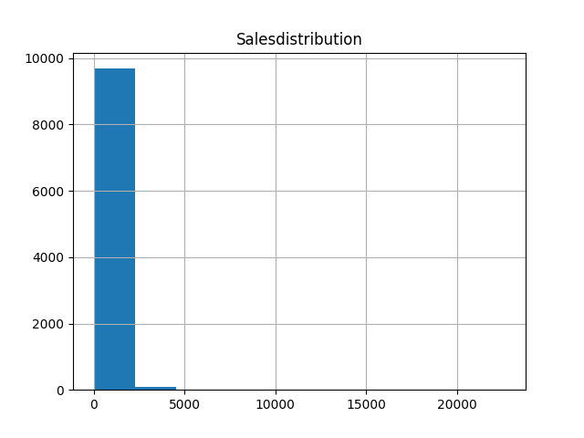
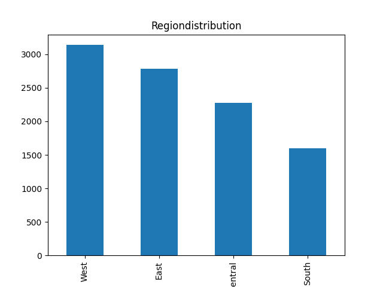
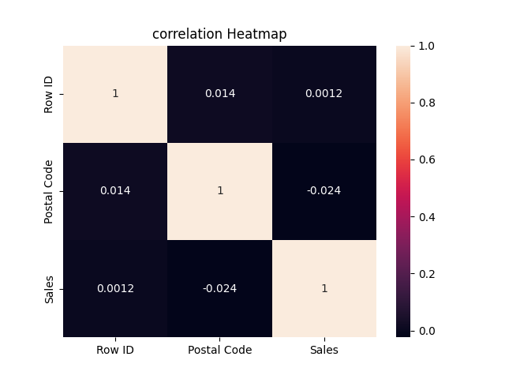

# 🚀 Automated Data Analysis Tool

## 📌 Overview

This project is an automated data analysis pipeline built using Python. It takes any CSV dataset as input, performs data cleaning, generates visualizations, and extracts meaningful insights automatically.

The goal of this project is to simplify and speed up Exploratory Data Analysis (EDA) for real-world datasets.

---

## 🎯 Features

*  Works with any CSV dataset
* Handles missing values using mean (numerical) and mode (categorical)
* Removes duplicate records
* Generates statistical summaries
* Performs categorical analysis
* Creates visualizations:

  * Histograms (numerical data)
  * Bar charts (categorical data)
  * Correlation heatmap
* Detects strong relationships between variables
* Saves graphs and insights automatically

---

## 🛠️ Tech Stack

* **Python**
* **Pandas**
* **NumPy**
* **Matplotlib**
* **Seaborn**

---

## 📂 Project Structure

```
analysis.py
Train.csv
README.md
outputs/
   ├── *_hist.png
   ├── *_bar.png
   ├── heatmap.png
   └── insights.txt
```

---

## ▶️ How to Run

1. Clone the repository:

```
git clone https://github.com/your-username/automated-data-analysis.git
```

2. Navigate to the project folder:

```
cd automated-data-analysis
```

3. Install dependencies:

```
pip install pandas numpy matplotlib seaborn
```

4. Run the script:

```
python analysis.py Train.csv
```

---

## 📊 Output

After running the project:

* 📈 Graphs are saved in the `outputs/` folder
* 📄 Insights are saved in `insights.txt`
* 📊 Summary statistics are printed in the terminal

---

## 📷 Sample Visualizations

### Histogram Example



### Bar Chart Example



### Correlation Heatmap



---

## 🧠 Key Learnings

* Data cleaning techniques (handling missing values)
* Exploratory Data Analysis (EDA)
* Data visualization
* Correlation analysis
* File handling and automation in Python

---

## 🚀 Future Improvements
* Export reports in PDF format
* Add outlier detection
* Support for Excel files

---

## 👨‍💻 Author

**Ayush Chib**

---

## ⭐ If you like this project

Give it a star on GitHub ⭐
